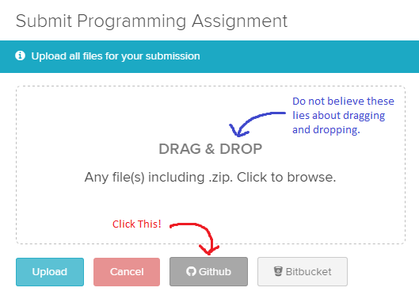
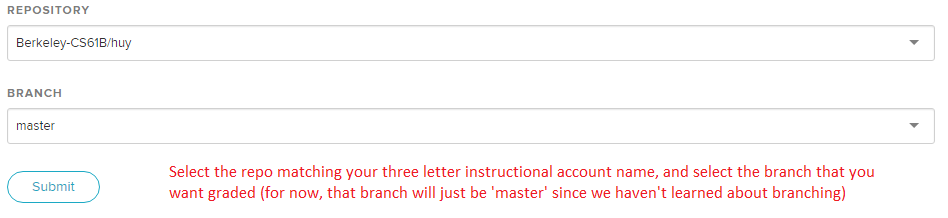

~ number: 1
~ title: javac, java, git

## Before You Begin ##
* If you haven't signed up to receive an instructional account, follow the
    instructions [here](https://piazza.com/class/ir6ikxxrjtm3j5?cid=35).
* If you haven't signed up to receive a GitHub repository, follow the instructions
  [here](https://piazza.com/class/ir6ikxxrjtm3j5?cid=50).
* The vast majority of students use their own computer instead of the lab
    computers. If you want to use your own computer, complete
    [lab1b](../lab1b/lab1b.html) before beginning this lab.
* Your instructional account is not likely to be useful to you other than checking
    your grades. To see how to use your instructional account, see 
    the [instructional accounts guide](../../guides/instructional-accounts.html)**.
* Be aware that there are a large number of setup steps this first week. **Don't
    be discouraged**, and make sure to ask for help if you're stuck! If you're an
    on-campus student, the best place to ask for help is in the actual lab. If
    you're not, Piazza is your best bet.
* Project 0 will allow pair-partnerships subject to [these
    rules](../../guides/partnerships.html). Lab might be a good place to meet a
    partner -- but make sure you both have the same Java background and are
    willing to work together in the same room (see partnership rules for details)!
* 
For those of you who have been working ahead, do not use
    IntelliJ  (from lab 2) today. For today's lab, please work from the command
    line to compile and run your code.

## A. Java Compilation & Development ##
Java 1.8 is currently installed on the instructional machines. You may need to
install it on your personal computer. You can find instructions to do this
above.

#### Introduction to Java ####

If you haven't already, read Chapter 1.1 of the [H61B
textbook](https://joshhug.gitbooks.io/hug61b/content/chap1/chap11.html).
Complete exercises 1.1.1 and 1.1.2. For this lab, you should use the command line,
not an IDE like IntelliJ or Eclipse (see lab 2). Don't worry about submitting
your work yet, we'll cover how to do that later in this lab.

## B. Git and Local Repositories ##

In 61B, you'll be required to use the git version control tool, which is wildly
popular out in the real world. Unfortunately, the abstractions behind it are
fairly tricky to understand, so it is likely that you will encounter significant
frustration at some point as you learn to use git.

Before you proceed, read sections A-C of Sarah Kim's [Using Git
Guide](../../guides/using-git.html)

**STOP! Do not proceed until you have read sections A
through C of the Git Guide.**
 You do not need to read section D or later.

#### Git Exercise

Now that you've read the first 3 sections of the git guide, you're now ready to
start using Git! Follow along with Sarah's example below. If you typed out all
the commands from the tofu example, you may skip this exercise.

If you'd like more of a challenge, read the direction for each step and guess
what the command should be before looking at the screenshots/running the
command.

1. Initialize a Git repository called `learning-git`.

    

2. Add a file called `HELLO.txt`.

    

3. Suppose we want to save the state of this file in git. First we stage it:

    

4. Now that we have staged `HELLO.txt`, it will be included in our commit.
Commit the file with a message of your choice.

    

5. Let's update our `HELLO.txt`. Here I used a text editor called vim to add
   some text to the file, and a tool called cat to show the file to you in the
   screenshot. You can use any text editor of your choice. If you've never used 
   vim, use a different text editor (it's hard to use for beginners). If you get
   stuck in vim, try googling to see how to get out of it. Getting stuck in vim
   is a [rite of passage](https://pbs.twimg.com/media/CCvkKq7WYAAAvkc.png).

    

6. If we want to save the change we made in git, first we'll have to stage it.
Stage it with the `add` command. Then, suppose we decide we no longer like the
change we made, and we don't want to save it in Git. Unstage the file with the
`reset` command. *Important*: The reset command does NOT change the actual
HELLO.txt file. In terms of our panorama analogy, it only deletes the picture
we took of this file!

    

7. Now suppose we dislike the changes we made and want to return the
file to its state the last time we committed it -- that is, before we added the
extra lines. Discard your changes to `HELLO.txt` since your first commit with
the `checkout` command. Here, instead of specifiying a commit ID, we'll use the
-- command, which uses the most recent commit by default.

    

**It is important that you understand every step of this example.** Please ask
for help if you are confused about any step.

## D. Git and Remote Repositories ##

We're now ready to finish off the lab. But first...

**STOP! Before you proceed, read section D of the [Using Git
Guide](../../guides/using-git.html).**
 There is no need to read sections E
or later. Those are for your later reference, and do not need to be read during
this lab.

In 61B, you'll be required to submit your code to your personal GitHub
repository. This is for several reasons:

* To spare you the incredible agony of losing your files.
* To submit your work for grading and to get results back from the autograder.
* To save you from the tremendous anguish of making unknown changes to your
    files that break everything.
* To ensure that we have easy access to your code so that we can help if you're
    stuck, and so that we can grade your code.
* **To dissuade you from posting your solutions on the web in a public GitHub
    repository**. This is a major violation of course policy!
* To expose you to a realistic workflow that is common on every major project
    you'll ever work on again.
* To enable safer, more equitable partner collaborations.

Before beginning this section ensure that the name of your GitHub repository in
the [Berkeley-CS61B organization](https://github.com/Berkeley-CS61B) matches
your instructional account login. If this is not true, please let your TA know.

**Note**: You'll need to perform this series of steps to set up your Git repo
on each computer you use (e.g. instructional computer, personal computer). If
you know that you'll only be using your personal computer, feel free to do this
only on your personal computer (and not your lab account).

1. Clone your [Berkeley-CS61B organization](https://github.com/Berkeley-CS61B)
repository.

    - Navigate to the spot in your folders on your computer that you'd like to
    start your repository.

            $ cd cs61b

    - Enter the following command to clone your GitHub repo. Make sure to
    replace the `**` with your own instructional account login/repo name.

        

            git clone https://github.com/Berkeley-CS61B/**.git

        

        <button class="btn" data-clipboard-target="#rem-1">Copy</button>

        If you'd like to SSH instead of HTTP (and [set up your own SSH
        key](https://help.github.com/articles/generating-ssh-keys/)), feel free
        to also do that instead. If you don't know what we're saying, then using
        https is fine. The advantage of SSH is that you won't have to type in
        your GitHub password every time you use your repository.

    - Move into your newly created repo! (Make sure you do this part, or the
    rest of the steps below will not work correctly.)

            $ cd **

2. Add the `skeleton` remote repository. You will pull from this remote
   repository to get starter code for assignments. (Make sure that you are
   within the newly created repository folder when the continue with these
   commands.)

    - Enter the following command to add the `skeleton` remote.
        

            git remote add skeleton https://github.com/Berkeley-CS61B/skeleton-sp17.git

        

        <button class="btn" data-clipboard-target="#rem-2">Copy</button>

    - Listing the remotes should now show both the `origin` and `skeleton`
    remotes.

            $ git remote -v

#### Working on the Skeleton

1. You must now pull from the `skeleton` remote in order to get the starter code
   for lab 1. You will also do this when new projects and assignments are
   released. To do this, use the spookiest command in the whole git toolbox:

        $ git pull skeleton master

    What this does is grab all remote files from the repo named `skeleton`
    (which is located at [https://github.com/Berkeley-CS61B/skeleton-sp17.git]
    (https://github.com/Berkeley-CS61B/skeleton-sp17.git)) and copies them into
    your current folder.

2. Move the `HelloWorld.java` and `HelloNumbers.java` that you previously
   created into the `lab1` directory. If you didn't create `HelloNumbers.java`, go back and
   do Exercise 1.1.2 (see part A of this lab).

3. Stage and commit `HelloWorld.java` and `HelloNumbers.java`.

        $ git add lab1/*
        $ git commit -m "Completed lab1"

4. Push these changes to the `master` branch on the `origin` remote repo.

        $ git push origin master

    You can verify that this has been successful by checking your repo on
    [github.com](https://github.com).

## E. Complete and Submit Lab 1 ##

Now that you have the skeleton, you should see a file in the lab1 directory
called `LeapYear.java`.

This program tests whether or not a given year is a Leap Year. The user will
give input as a command line parameter, and then print out whether or not the
date is a valid date, e.g.

    $ java LeapYear 2000
    2000 is a leap year.
    $ java LeapYear 1999
    1999 is not a leap year.
    $ java LeapYear 2004
    2004 is a leap year.
    $ java LeapYear 2100
    2100 is not a leap year.

Your code must declare a method as follows: `public static boolean
isLeapYear(int year)`. This method will be tested by the Gradescope autograder.
Make sure to provide a Javadoc description of the method.

Some Java tips:
 * The `%` operator implements remainder. Thus, the value of `year % 4` will be
    `0`, `1`, `2`, or `3`.
 * The `!=` operator compares two values for inequality. The code fragment `if
    (year % 4 != 0)` reads as "if the remainder when dividing year by 4 is not
    equal to 0."
 * When one of the arguments of the `+` operator is a String, the arguments are
    concatenated as Strings. For example, `"horse"` + `"babies"` would return
    `"horsebabies"`

Once you're done, push your code to GitHub, and submit `LeapYear.java` and
`HelloNumbers.java` to Gradescope. To sign up for gradescope, head to
[gradescope.com](http://gradescope.com) and click on the "Sign up for free" link
at the top right. Use the entry code posted in this [Piazza
thread](https://piazza.com/class/ir6ikxxrjtm3j5?cid=6). 

To submit your code, do NOT use the Drag and Drop feature. Instead, click the little
GitHub button in the bottom right (shown below).

After clicking this button, you'll be taken to a screen where you select your
repository and branch (shown below). If your login is "ape", you'll select "ape" in the top box,
and in the bottom box you'll pick "master". Later, you can create your own branches
if you want those graded instead, though that won't be required in 61B.

Please report any issues you may have in [this Piazza
thread](https://piazza.com/class/ir6ikxxrjtm3j5?cid=7). Entire error messages
and/or screenshots are welcome.

**Important: ** We HIGHLY encourage you to make frequent commits! **Lack of
proper version control will not be considered an excuse for lost work,
particularly after the first few weeks.**

## Recap ##

1. Java is a compiled language. You can use `javac` and `java` to compile and
run your code.

2. Java is an object-oriented language. Every Java file must contain either a
class, interface, or enum.

3. When running a Java program, the `main` method runs. This `main` method
can call other methods/classes in the program.

4. Git is a version control system that tracks the history of a set of files in
the form of commits.

5. Commit often and use informative commit messages.

6. Pull from the `skeleton` remote repository to get or update starter code for
assignments.

7. Use Gradescope to submit homework, labs, and projects.
